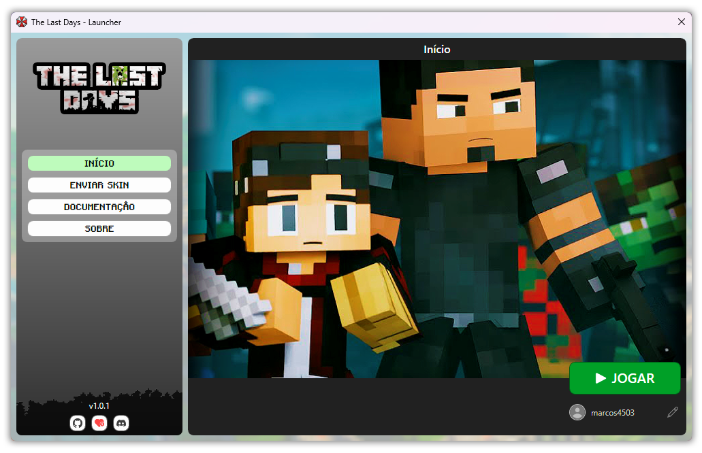

    
      
    Go to "Releases" page, and find the "1.0.0" version, in "Assets" section, download the file "The_Last_Days.exe". Read all the instructions below and then just enjoy! 

# About this Software

The Last Days Launcher is an all-in-one Launcher for a Modpack created by me called "The Last Days". In this Modpack, you need to live in a post-apocalyptic world, infested by Zombies and Mutant Creatures. You need to survive, search, steal, kill, build, arm yourself, ally, research, hide, and much, much, much more. The Modpack is basically a mix of Minecraft with RPG elements and survival games like DayZ and Project Zomboid.

Thanks to The Last Days Launcher, it's as if this Modpack was a completely Standalone game, as The Last Days Launcher is capable of doing everything you need. As soon as you open it, the Launcher will update itself, download game files, install Mods, update settings, etc. Additionally, if there are updates to the game files, or mods, or anything else, The Last Days Launcher will take care of the update for you, automatically. Once the game is ready, you can still use the Launcher to view the Modpack documentation, change your game nickname and much more!

If you want to run a The Last Days Modpack server, <a href="https://github.com/marcos4503/the-last-days-server-panel" target="_blank">try this</a>!

# To use this Software

Follow the steps below to install The Last Days Launcher on your computer and play the Minecraft Modpack, "The Last Days" using this Launcher.

<b>1.</b> Go to the "Releases" page of this repository and look for version "1.0.0", then in the "Assets" section download the file "The_Last_Days.exe" to your computer.

<b>2.</b> Run the file "The_Last_Days.exe" now. The Last Days will open and the Launcher will begin performing all the necessary steps to install/update your game, until it is 100% ready to play!

That is all! Don't forget to continue reading the rest of the content below to find out everything you need to know!

# Prerequisites to use this Software or Modpack

You need to fulfill some requirements to be able to use this Software or play the The Last Days Modpack...

- The computer may need to have <a href="https://download.visualstudio.microsoft.com/download/pr/81531ad6-afa9-4b61-9d05-6a76dce81123/2885d26c1a58f37176fd7859f8cc80f1/dotnet-sdk-6.0.417-win-x64.exe" target="_blank">.Net 6.0</a> installed in order to run the Software.
- Your computer must have Microsoft Edge installed.
- The computer must be 64-bit.
- Your computer's operating system must be Windows 10 or newer.
- Your computer must have at least 25GB free on drive C.

# Minimum Hardware requirements to play Modpack

- 12 Thread CPU (like "Intel i5 11400" or "AMD Ryzen 5 5600") or better.
- 16GB of RAM DDR4 or better.
- Graphics of NVidia GTX 1650 / AMD RX 580 or better.
- NVMe SSD is recommended (especially if you intend to run a server from this modpack).

# How to edit this Software

The source project of this Software is here in this repository as well. You can simply open the "The-Last-Days-Source" folder with your Visual Studio IDE and edit the Software.

# Support projects like this

If you liked the The Last Days Launcher and found it useful for your, please consider making a donation (if possible). This would make it even more possible for me to create and continue to maintain projects like this, but if you cannot make a donation, it is still a pleasure for you to use it! Thanks! 😀

 

    

 

Created with ❤ by Marcos Tomaz

